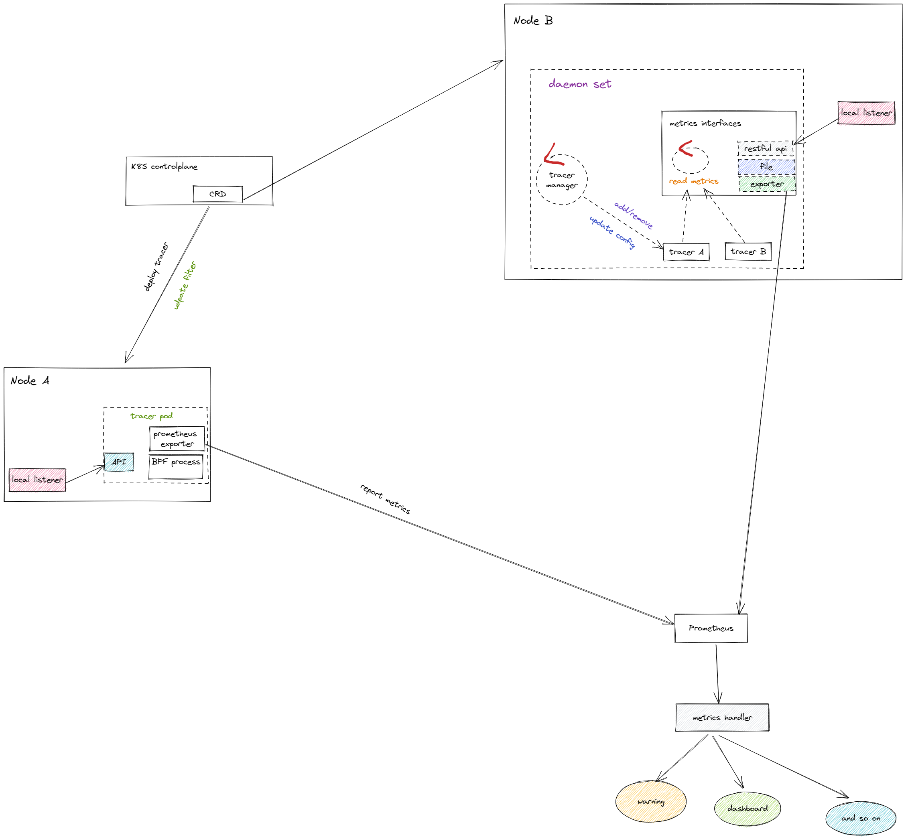

#ebpf #KubeHawk

---------

| Author | 刘昊                   |
| ------ | -------------------- |
| Date   | 2022-03-10           |
| Email  | knowledgehao@163.com |

-------------

## 简介

建仓PR：https://gitee.com/openeuler/community/pulls/3311
相关仓库：

- https://gitee.com/openeuler/KubeHawk

- https://gitee.com/openeuler/KubeHawkeyes
  
  ### 愿景
  
  实现云原生的方式对`K8S`集群的监控和跟踪，整个方案具备高拓展性、灵活性、易用性、低开销、高效率等特点。实现用户业务无感知的监控和跟踪。基于[KubeHawkeyes](https://gitee.com/openeuler/KubeHawkeyes)提供标准的BPF能力实现。
  
  ### 基本架构
  
  

- 通过`CRD`实现Tracer和Filter的定义，对BPF和exporter的管理，以及监控的Pod的条件的管理；

- 封装BPF程序和exporter到一个Tracer Pod，实现数据采集和上报的统一管理；

- 采集的数据支持多种分发方式，上报到Prometheus以及本地的订阅模式；

- 集群的数据由Prometheus的拓展机制进行处理（可以和Tracer部署时一起部署）；

- `CRD`的控制器需要支持Tracer的按需部署，以及过滤条件的动态刷新；
  
  ## 模块分解
  
  ### `CRD`和控制器
  
  主要是要解决Tracer的管理问题：

- 如何部署Tracer；

- Tracer关注哪些Pod/命名空间（以命名空间为粒度是比较合适的）；
  
  ### Tracer实现
  
  主要解决两个问题：

- 如何管理BPF工具采集期望的数据；

- 以及采集的数据如何分发；
  
  #### Prometheus export
  
  单节点的采集数据，如何上报汇总到整个集群数据库。
  
  #### HTTP Server

- 解决采集数据的本节点分发问题；

- 提供更新采集目标（Pod）的机制；

*注意：由于libbpf使用C，导致`http-server`的实现比较苦难，建议使用[libbpfgo](https://github.com/aquasecurity/libbpfgo)库。基于Golang实现*

## 方案

整体结构比较明确，但是如何部署、调度Tracer存在多种方案，各有优劣。

### 方案一

BPF程序、exporter、`http-sever`编译到一个镜像里面，通过Pod/Job的方式进行集群调度，对应设计图中的`Node A`。这种方式，整体结构会比较简单，明确，每一个BPF工具就是一个独立完整的Pod/Job。缺点是，Pod/Job存在被迁移的风险，而且同一个节点的多个BPF工具就会有多个`export/http-server`，这无疑会导致资源的浪费，最后`KubeHawkeyes`相应的规范会比较复杂，规范包含的组件比较多，而且对BPF工具开发者的要求比较高。

### 方案二

每个节点一个`DaemonSet`，运行exporter和`http-server`，管理节点上的所有BPF程序，对应设计图中的`Node B`。优点是可以保障节点的BPF程序运行环境的稳定性，可以共享`export/http-server`等通用资源，而且`KubeHawkeyes`相应的标准制定也比较简单，对开发者比较友好。缺点就是管理逻辑会比较复杂。

## 问题

- 如何简单快速的集成已有的BCC或者libbpf的程序？
- `KubeHawkeyes`是否能够提供自动化的转换工具？

这对于`KubeHawkeyes`提出了标准化的要求，需要有非常准确的规范。